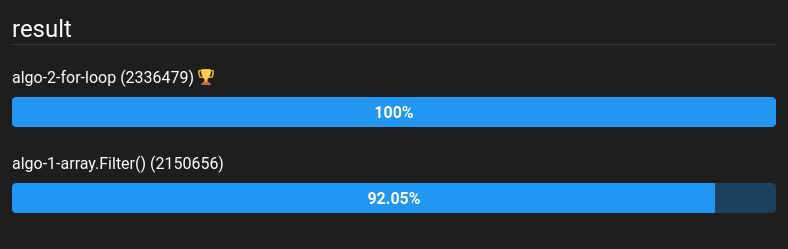

# Formation développeur d'application - Javascript React

## Développez un algorithme de recherche en JavaScript
_Projet 7 - les petits plats - Juin 2022_

## Mission 
 * Implémenter la fonctionnalité de recherche;
 * Le code passe avec succès le validateur W3C;
 * Réaliser deux implémentations et les comparer comparer, en se focalisant uniquement sur le champ de recherche principal.

## Compétences évaluées  

* Analyser un problème informatique  
* Développer un algorithme pour résoudre un problème

## Outils

* JsBench : `https://jsben.ch/`

## Techno utilisés pour le projet  

* ### frontend
  * HTML
  * CSS
  * JavaScript
  
